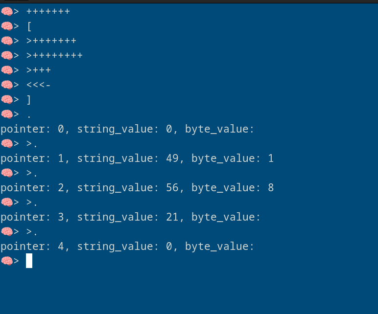

# brainfuck cli interpreter


## insatll
``` bash
go install github.com/mreza0100/brainfuck-cli@latest
```

# usage

### interactive mode
```bash
brainfuck-cli i
```
<!-- use image -->



### read from args
```bash
brainfuck-cli r ">+++++++++[<++++++++>-]<.>+++++++[<++++>-]<+.+++++++..+++.[-]>++++++++[<++++>-] <.>+++++++++++[<++++++++>-]<-.--------.+++.------.--------.[-]>++++++++[<++++>- ]<+.[-]++++++++++."
```
### read from file
```bash
brainfuck-cli f ./test.bf
```
